# Backup and restore stateful applications between Kubernetes and OpenShift

Robin Cloud Native Storage is an application-aware container storage that offers advanced data management capabilities and runs natively on any Kubernetes distribution including IBM Kubernetes Service and Red Hat OpenShift Kubernetes Service. Robin Cloud Native Storage enables you to Protect (via Snapshots, Backups), Secure (via encryption), Collaborate (via Clones and git like push/pull workflows), and make Portable (via Cloud-sync) any Stateful application that is deployed using Helm Charts or Operators.

In this code pattern we will take a snapshot of an n-tier stateful application, create a backup and restore the backup using Robin CNS. We will migrate stateful application from IBM Kubernetes Service to Red Hat OpenShift Kubernetes Service. We will deploy a simple `Employee Database` application which can add/edit/delete employees data through a simple UI. Employees data will be stored in PostgreSQL database. In this code pattern we will show how to take snapshots of running application, back them up and restore the application state with just a few simple commands.

When you have completed this code pattern, you will understand how to:
- Setup Robin CNS
- Create snapshots and backup your stateful applications on to a remote Object Storage
- Package a n-tier application into a simple Robin Flexapp
- Restore any backup to any local/remote Kubernetes distribution


<!--add an image in this path-->
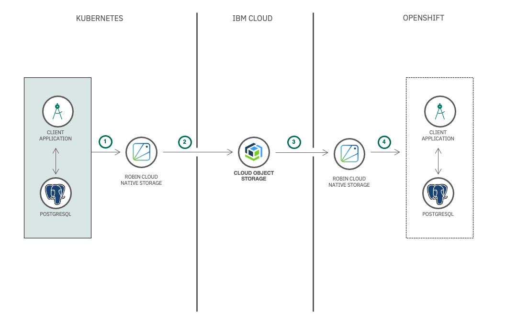

<!--Optionally, add flow steps based on the architecture diagram-->
## Flow

1. Package your n-tier stateful application into a Robin FlexApp on Kubernetes
2. Capture Robin Snapshot of the FlexApp and backup to Cloud Object Storage
3. Decrypt the backup from Cloud Object Storage and restore the backup on OpenShift
4. Create a Robin FlexApp from the restored backup to get the stateful application as it is from Kubernetes to OpenShift

<!--Optionally, update this section when the video is created-->
# Watch the Video

<!-- [](https://www.youtube.com/watch?v=Jxi7U7VOMYg) -->

Comming Soon.

# Prerequisites
- [Robin Installation Tutorial](https://github.com/IBM/setup-robin-cns): Follow the tutorial and setup robin Cloud Native Storage on Kubernetes and OpenShift.
- [Helm CLI](https://helm.sh/docs/intro/install/#from-script): Download and install the Helm CLI.

# Steps

1. [Setup applications on Kubernetes to simulate existing environment](#step-1-setup-applications-on-kubernetes-to-simulate-existing-environment)
1. [Backup stateful application](#step-2-backup-stateful-application)
1. [Restore the backed-up stateful application on OpenShift](#step-3-restore-the-backed-up-stateful-application-on-openshift)
1. [Verify the restored Stateful Application](#4-verify-the-restored-stateful-application)
1. [(Optional) Simulate catastrophic failure and recover from it](#step-5-optional-simulate-catastrophic-failure-and-recover-from-it)

## Step 1: Setup applications on Kubernetes to simulate existing environment

> In this step you will deploy a stateful application on Kubernetes cluster. If you already have a stateful application deployed, then you may skip this step and proceed with [step 2](#step-2-backup-stateful-application)
### 1. Clone the Repo
- Clone the `backup-and-restore-stateful-applications-between-iks-and-roks` repo locally. In a terminal, run:
```bash
git clone https://github.com/IBM/backup-and-restore-stateful-applications-between-iks-and-roks.git
```

### 2. Setup Postgresql
Once you have registered the repo you can go ahead and deploy a n-tier application which includes a client application and a database. In this section you will learn how to deploy postgresql database on kubernetes through helm charts.

#### 2.1. Install Postgresql

- In terminal, run the following command to install postgresql:
    ```bash
    helm repo add bitnami https://charts.bitnami.com/bitnami
    helm install t3-db bitnami/postgresql --set persistence.storageClass=robin -n demo
    ```
    ```
    NAME: t3-db
    LAST DEPLOYED: Thu May  6 10:54:56 2021
    NAMESPACE: demo
    STATUS: deployed
    REVISION: 1
    TEST SUITE: None
    NOTES:
    ** Please be patient while the chart is being deployed **

    ...

    ```

- You will need the postgresql username, password, hostname and port to connect it to the client application. In terminal, run the following commands to get the password and ip address.
    - Run the following command to get the `IP_ADDRESS`:
        ```bash
        export IP_ADDRESS=$(kubectl get service -n demo t3-db-postgresql -o jsonpath={.spec.clusterIP}) && echo $IP_ADDRESS
        ```

    - Run the following command to get the `POSTGRES_PASSWORD`:
        ```bash
        export POSTGRES_PASSWORD=$(kubectl get secret --namespace demo t3-db-postgresql -o jsonpath="{.data.postgresql-password}" | base64 --decode) && echo $POSTGRES_PASSWORD
        ```

- At this point, you will have the Postgresql credentials as follows:
    - `username`: **postgres**
    - `password`: $POSTGRES_PASSWORD
    - `hostname`: $IP_ADDRESS
    - `port`: **5432**

#### 2.2: Configure Postgresql

- Once you have the credentials, connect to the postgres-client and create a database named `records` that will be used by the client application to store data. In terminal, run the following command:
    ```bash
    kubectl run t3-db-postgresql-client --rm --tty -i --restart='Never' --namespace demo --image docker.io/bitnami/postgresql:11.11.0-debian-10-r71 --env="PGPASSWORD=$POSTGRES_PASSWORD" --command -- psql --host t3-db-postgresql -U postgres -d postgres -p 5432
    ```

    >Note: The default username for Postgresql is `postgres` and the default port is `5432`.

- You will enter the postgres prompt, run the `create` command to create a database.
    ```
    postgres=# create database records;
    CREATE DATABASE
    postgres-# 
    ```
- You can exit the postgres-client by running the `exit` command.
    ```
    postgres=# exit
    $ 
    ```

### 3. Setup Client Application
Similarly, deploy the client application to access the postgresql database and perform Create, Read, Update and Delete (CRUD) operations on the table.

#### 3.1: Install Client Application

- In the cloned directory, navigate to `client-application/helm-chart/` directory and run the `helm install` command.
    ```bash
    cd client-application/helm-chart/
    helm install -n demo t3-client .
    ```

#### 3.2: Configure Client Application

- Once the client application is installed, access it by port forwarding. In terminal, run the following commands:
    - Get the pod name:
        ```bash
        kubectl get pods -n demo
        ```
        ```
        NAME                                    READY   STATUS    RESTARTS   AGE
        t3-client-deployment-789f9f54fb-5tlhn   1/1     Running   0          8d
        t3-db-postgresql-0                      1/1     Running   0          8d
        ```
    - Port forward the pod:
        ```bash
        kubectl port-forward t3-client-deployment-789f9f54fb-5tlhn 8080 -n demo
        ```
        ```
        Forwarding from 127.0.0.1:8080 -> 8080
        Forwarding from [::1]:8080 -> 8080
        ```
- Visit <http://localhost:8080> in your browser to access the Client Application.
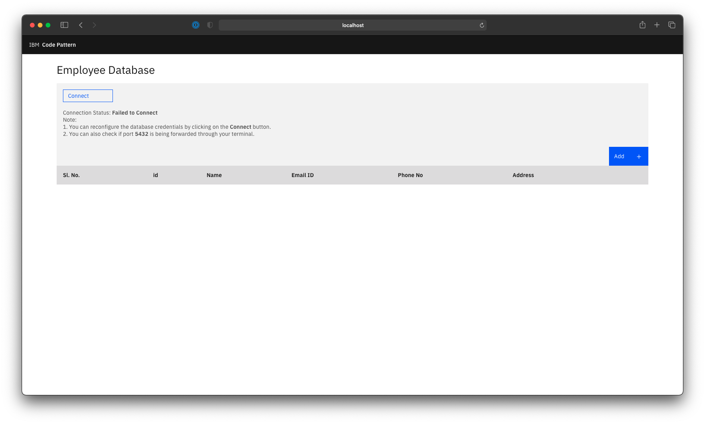

- Click on **Connect** button and enter the database credentials that you copied in [2.1](#21-install-postgresql) and click on **Submit**. The Client Application will now be connected to the postgresql database.
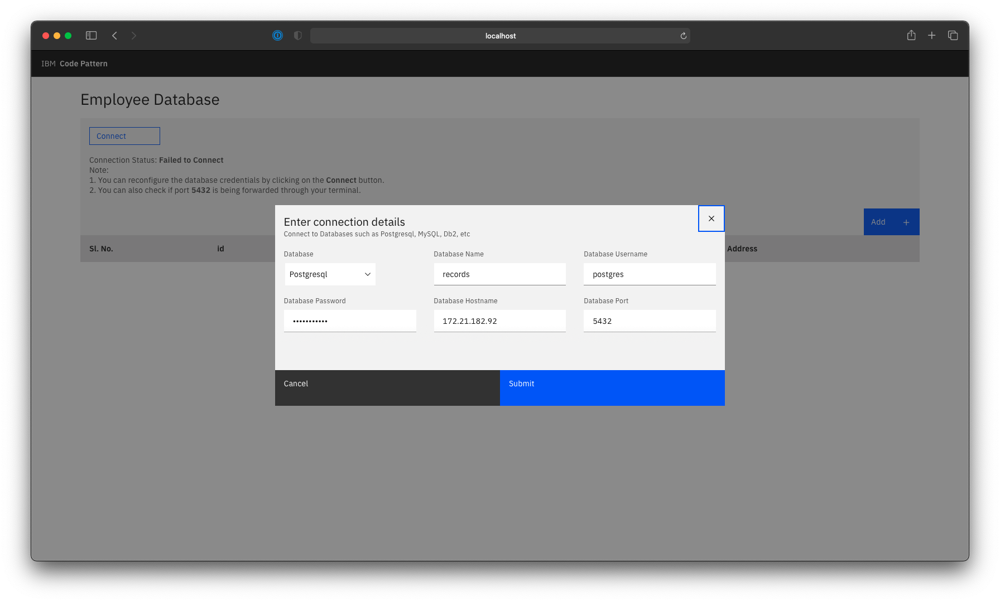

>Note: You can verify the connection status under **Connection Status** section of the client application

- Add some records by clicking on the **Add** button.
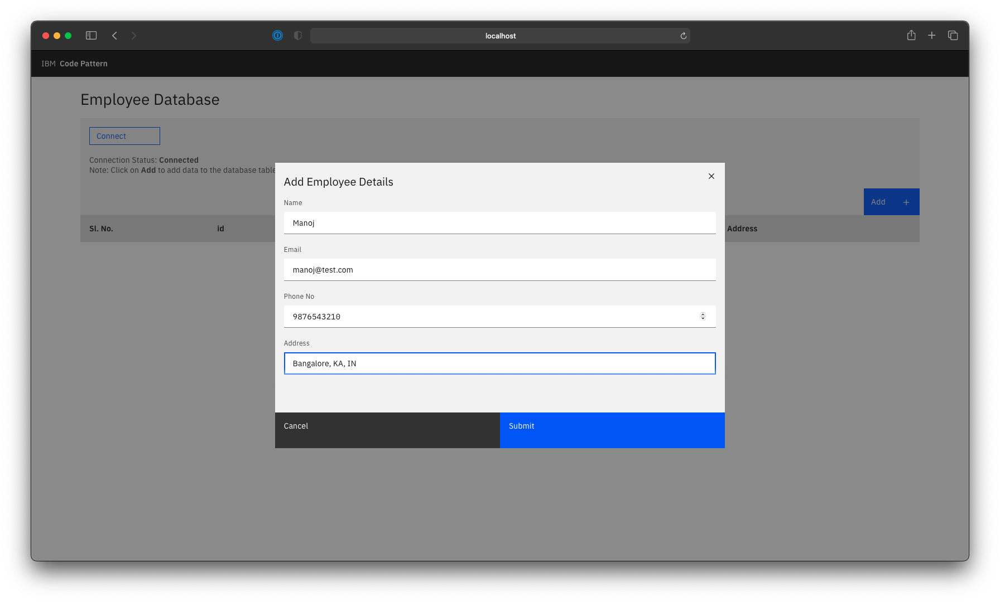

- Once you have populated the database table, you can migrate the n-tier application to OpenShift.
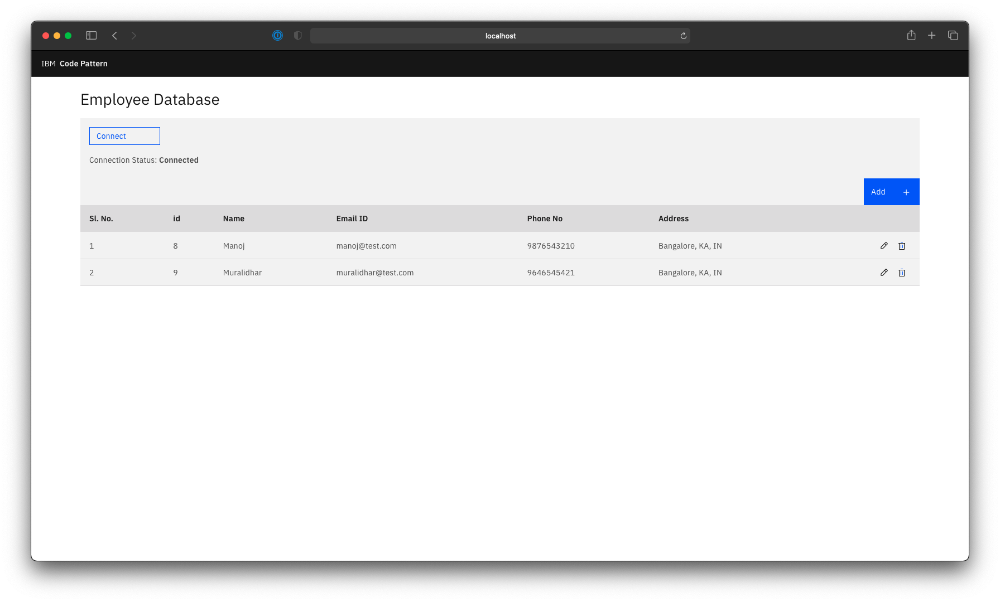


## Step 2: Backup stateful application

### 1. Create Object Storage
- Login to IBM Cloud, and create a Cloud [Object Storage](https://cloud.ibm.com/objectstorage/create). Select the **Standard** plan and click on **Create**.
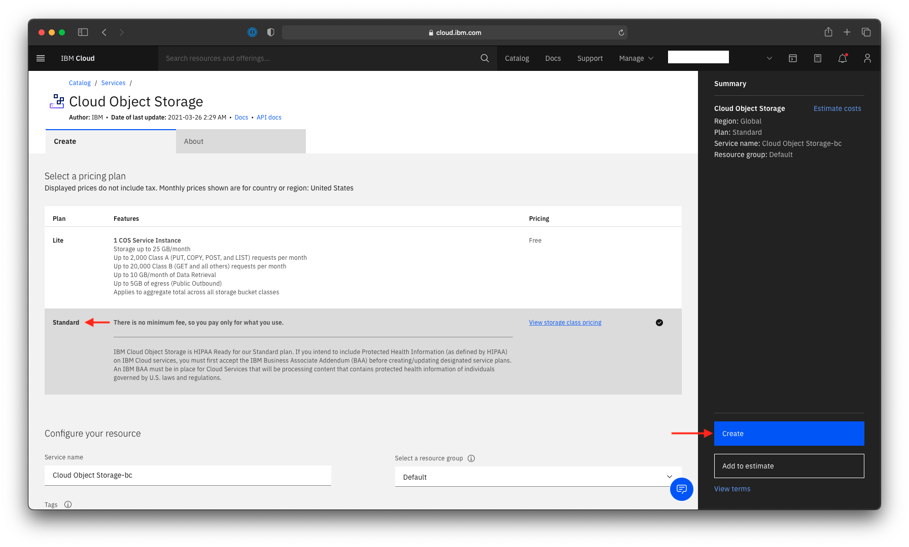

- Once the Cloud Object Storage is created, in the IBM Cloud Resources, select the Object Storage.

- You will have to copy certain credentials in order to register Robin CNS to the Object Storage.

- Click on the **Endpoints** on the left panel and select **resiliency** and **location** in which you wish to create an Object Storage Bucket. Copy the public `endpoint` from the location as shown. In our case we selected the `ap-geo` endpoint.
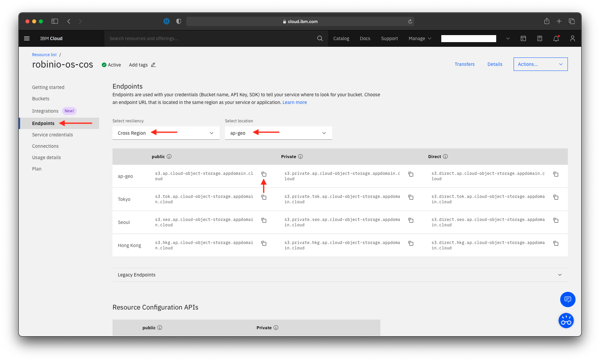

- Click on the **Service credentials** on the left panel and click on **New credentials**.

- While creating a new credential, under the **Advance options** ensure that you turn on the **Include HMAC Credential**. Click on **Add** to create a credential.


- Once the credential is created, under **cos_hmac_keys** copy the `access_key_id` and `secret_access_key` from the credentials as shown.
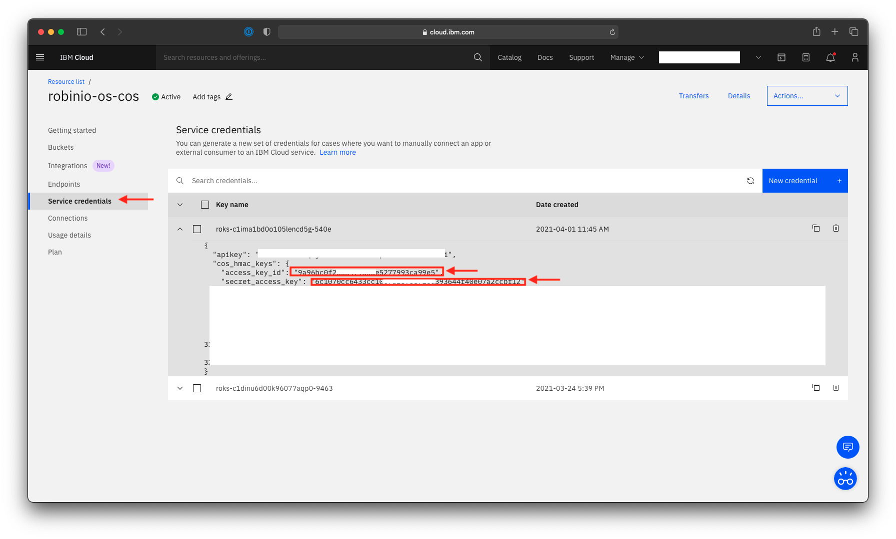

- In the parent directory of the cloned repo, add the copied `access_key_id`, `secret_access_key` and `endpoint` to the [`credentials.json`](credentials.json) file.
    ```json
    {
        "aws_access_key_id" : "<access_key_id>",
        "aws_secret_access_key" : "<secret_access_key>",
        "end_point": "<endpoint>"
    }
    ```

- At this point you have successfully:
    - Created a Cloud Object Storage and copied the credentials required for the further setup

### 2. Register a Repo in Kubernetes
>Note: Before you proceed with the documentation, make sure you have logged into the Kubernetes cluster from your CLI. You will have already learned how to connect to your cluster through kubectl command in the [Robin Installation Tutorial](../install-robin-cns-on-iks-and-roks/).

A Cloud Object Storage is required to backup the stateful application snapshot from Kubernetes cluster to Object Storage. Furthermore, the same backup will be decrypted and restored on the OpenShift cluster. Since you will have already created a Cloud Object storage in [Step 2](#step-2-create-object-storage) and saved the credentials, you can now register it on Robin.

- In terminal, access the Robin Client through the pod which you have learn't in the [Robin Installation Tutorial](../install-robin-cns-on-iks-and-roks/).
    ```bash
    kubectl exec -it robin-85pnq -n robinio -- bash
    ```
    ```
    [robinds@kube-c1ima1bd0o105lencd5g-robiniooscl-default-0000029e ~]#
    ```

- In terminal, under the robin prompt, run the `robin login` command with default username as `admin` and password as `Robin123`:
    ```
    [robinds@kube-c1ima1bd0o105lencd5g-robiniooscl-default-0000029e ~]# robin login admin
    Password: 
    User admin is logged into Administrators tenant
    [robinds@kube-c1ima1bd0o105lencd5g-robiniooscl-default-0000029e ~]#
    ```

- Copy the [`credentials.json`](credentials.json) that you prepared in [Step 2](#step-2-create-object-storage) into the client pod. You can do so with `vi` editor on the client pod. In terminal, run the following command:
    ```
    [robinds@kube-c1ima1bd0o105lencd5g-robiniooscl-default-0000029e ~]# vi credentials.json
    ```
- Copy and paste the entire json in the vi editor and hit the `ESC` key then `:wq` and press enter to save the file.
    ```json
    {
        "aws_access_key_id" : "xxxx",
        "aws_secret_access_key" : "xxxx",
        "end_point": "s3.xxxx.cloud-object-storage.appdomain.cloud"
    }
    ```
- Now once you have the credentials in place, run the robin repo register command. In terminal, run the following command:
    ```
    [robinds@kube-c1ima1bd0o105lencd5g-robiniooscl-default-0000029e ~]# robin repo register psqlbackups s3://robin-backup-bucket/psqlbackups credentials.json readwrite --wait
    ```

    >NOTE: The string `s3://robin-backup-bucket/psqlbackups` indicates `s3|gcs://bucket[/path/to/folder]`. `psqlbackups` is the bucket that will be created in Object Storage. You can learn more about the `robin repo register` command in the [docs here](https://docs.robin.io/storage/latest/repo.html#register-a-repo).

- You have successfully registered the repo with robin, verify it by running the following command:
    ```
    [robinds@kube-c1ima1bd0o105lencd5g-robiniooscl-default-0000029e ~]# robin repo list
    ```
    ```
    +-------------+--------+----------------------+--------------+---------------------+---------------+-------------+
    | Name        | Type   | Owner/Tenant         | BackupTarget | Bucket              | Path          | Permissions |
    +-------------+--------+----------------------+--------------+---------------------+---------------+-------------+
    | psqlbackups | AWS_S3 | admin/Administrators | 1            | robin-backup-bucket | psqlbackups/ | readwrite   |
    +-------------+--------+----------------------+--------------+---------------------+---------------+-------------+
    ```

### 3. Create a FlexApplication in Robin CNS

If you have followed [step 1](#step-1-setup-applications-on-kubernetes-to-simulate-existing-environment) you will have a database and a client application deployed in Kubernetes cluster. If you have not followed step 1 and you have your own application, then you will have to replace application names accordingly. In this step you will learn how to package multiple applications into a Robin FlexApp and take a snapshot. By packaging multiple deployments into once single FlexApp, it becomes easier to migrate everything together rather than migrating individual deployments.

- In terminal, access the Robin Client through the pod which you have learn't in the [Robin Installation Tutorial](../install-robin-cns-on-iks-and-roks/).
    ```bash
    kubectl exec -it robin-85pnq -n robinio -- bash
    ```
    ```
    [robinds@kube-c1ima1bd0o105lencd5g-robiniooscl-default-0000029e ~]#
    ``` 

- You can see the helm apps deployed in your cluster by running the folowing command:
    ```
    [robinds@kube-c1ima1bd0o105lencd5g-robiniooscl-default-0000029e ~]# robin app list
    ```
    ```
    Helm/Flex Apps:

    +-----------+---------+--------+----------------------+-----------+-----------+---------+
    | Name      | Type    | State  | Owner/Tenant         | Namespace | Snapshots | Backups |
    +-----------+---------+--------+----------------------+-----------+-----------+---------+
    | t3-client | helm    | ONLINE | admin/Administrators | demo      | 0         | 0       |
    | t3-db     | helm    | ONLINE | admin/Administrators | demo      | 0         | 0       |
    +-----------+---------+--------+----------------------+-----------+-----------+---------+
    ```

- Run the following command to package the `t3-client` and `t3-db` into a FlexApp called `emp-mgmt`.
    ```
    [robinds@kube-c1ima1bd0o105lencd5g-robiniooscl-default-0000029e ~]# robin app register emp-mgmt --selector app.kubernetes.io/instance=t3-client --selector app.kubernetes.io/instance=t3-db -n demo
    ```
    > Learn more about Robin FlexApp [here](https://docs.robin.io/storage/latest/apps.html#robin-flexapp-applications).

- You can see the `emp-mgmt` FlexApp now listed in your cluster by running the folowing command:
    ```
    [robinds@kube-c1ima1bd0o105lencd5g-robiniooscl-default-0000029e ~]# robin app list
    ```
    ```
    Helm/Flex Apps:

    +-----------+---------+--------+----------------------+-----------+-----------+---------+
    | Name      | Type    | State  | Owner/Tenant         | Namespace | Snapshots | Backups |
    +-----------+---------+--------+----------------------+-----------+-----------+---------+
    | t3-client | helm    | ONLINE | admin/Administrators | demo      | 0         | 0       |
    | t3-db     | helm    | ONLINE | admin/Administrators | demo      | 0         | 0       |
    | emp-mgmt  | flexapp | ONLINE | admin/Administrators | demo      | 0         | 0       |
    +-----------+---------+--------+----------------------+-----------+-----------+---------+
    ```

- To see what are the resources tagged in `emp-mgmt` run the following command:
    ```
    [robinds@kube-c1ima1bd0o105lencd5g-robiniooscl-default-0000029e ~]# robin app info emp-mgmt --status
    ```

    ```
    +-----------------------+---------------------------+--------+---------+
    | Kind                  | Name                      | Status | Message |
    +-----------------------+---------------------------+--------+---------+
    | ServiceAccount        | t3-client                 | Ready  | -       |
    | Secret                | t3-db-postgresql          | Ready  | -       |
    | PersistentVolumeClaim | data-t3-db-postgresql-0   | Bound  | -       |
    | Pod                   | t3-db-postgresql-0        | Ready  | -       |
    | Service               | t3-client-service         | Ready  | -       |
    | Service               | t3-db-postgresql          | Ready  | -       |
    | Service               | t3-db-postgresql-headless | Ready  | -       |
    | StatefulSet           | t3-db-postgresql          | Ready  | -       |
    | Deployment            | t3-client-deployment      | Ready  | -       |
    +-----------------------+---------------------------+--------+---------+

    Key:
    Green: Object is running
    Yellow: Object is potentially down
    Red: Object is down

    ```

- At this point, you will have successfully:
    - Deployed Client and DB applications
    - Packaged them into a Robin FlexApp

- You can now create a snapshot, and backup to Object storage.

### 4. Attach the FlexApp to the Repo
In order to take a backup in Object storage, you will have to attach your FlexApp to the Repo that you registered in [step 2](#step-2-create-object-storage).

- Run the following command to attach `emp-mgmt` to the `psqlbackups` bucket
```
[robinds@kube-c1ima1bd0o105lencd5g-robiniooscl-default-0000029e ~]# robin app attach-repo emp-mgmt psqlbackups --wait
```
- Once the Job is finished `emp-mgmt` will be linked to the `psqlbackups` bucket in the Cloud Object Storage.

### 5. Run the script to create a Snapshot, Backup and Export it
The automated script basically runs a set of Robin commands to perform the following tasks:
- Create a Snapshot of the App
- Create a Backup of the Snapshot and store it in Cloud Object Storage
- Export the sha5 token that can be used to decrypt the backup

In the parent directory of the cloned repo, goto `scripts/` directory. You will be using the `robinbackup.sh` script at this point.

- Copy the `robinbackup.sh` script to the robin pod. You can do so with `vi` editor on the client pod. In terminal, run the following command:
    ```
    [robinds@kube-c1ima1bd0o105lencd5g-robiniooscl-default-0000029e ~]# vi robinbackup.sh
    ```
- Copy and paste the entire json in the vi editor and hit the `ESC` key then `:wq` and press enter to save the file.

- The script takes 4 arguments:
    - `-a`: Application name that you want to backup
    - `-b`: Backup name
    - `-s`: Snapshot name
    - `-r`: Object Storage Repo name

- Since you will backup the `emp-mgmt` FlexApp you can give the `-a` as `emp-mgmt`. In terminal, run the following command:
    ```
    [robinds@kube-c1ima1bd0o105lencd5g-robiniooscl-default-0000029e ~]# ./robinbackup.sh -a emp-mgmt -s snapof2records -b emp-mgmt-backup -r psqlbackups
    ```

    ```
    1/3: Creating a snapshot of emp-mgmt

    Job:  579 Name: K8SApplicationSnapshot State: PROCESSED       Error: 0
    Job:  579 Name: K8SApplicationSnapshot State: WAITING         Error: 0
    Job:  579 Name: K8SApplicationSnapshot State: COMPLETED       Error: 0

    +----------------------------------+--------+----------+----------+-------------------------+
    | Snapshot ID                      | State  | App Name | App Kind | Snapshot name           |
    +----------------------------------+--------+----------+----------+-------------------------+
    | 0ca41654af0e11ebad8c81e299357339 | ONLINE | emp-mgmt | flexapp  | emp-mgmt_snapof2records |
    +----------------------------------+--------+----------+----------+-------------------------+

    2/3: Backing up 0ca41654af0e11ebad8c81e299357339

    Creating app backup 'emp-mgmt-backup' from snapshot '0ca41654af0e11ebad8c81e299357339'
    Job:  583 Name: K8SApplicationBackup State: PROCESSED       Error: 0
    Job:  583 Name: K8SApplicationBackup State: PREPARED        Error: 0
    Job:  583 Name: K8SApplicationBackup State: AGENT_WAIT      Error: 0
    Job:  583 Name: K8SApplicationBackup State: COMPLETED       Error: 0

    +----------------------------------+-----------------+-------------+-------------------------+--------+
    | Backup ID                        | Backup Name     | Repo        | Snapshot Name           | State  |
    +----------------------------------+-----------------+-------------+-------------------------+--------+
    | 1755d024af0e11eb863f3d26fe831c20 | emp-mgmt-backup | psqlbackups | emp-mgmt_snapof2records | Pushed |
    +----------------------------------+-----------------+-------------+-------------------------+--------+

    3/3: Exporting Backup

    eyJiYWNrdXBfaWQiOiAiMTc1NWQwMjRhZjBlMTFlYjg2M2YzZDI2ZmU4MzFjMjAiLCAiYmFja3VwX3BhdGgiOiAicGdzcWxiYWNrdXBzLzE2MTgzODU1NzMvZW1wLW1nbXRfMTIvMTc1NWQwMjRhZjBlMTFlYjg2M2YzZDI2ZmU4MzFjMjAvYXBwY29uZmlnL2JhY2t1cF9tZXRhZGF0YS5qc29uIiwgInJlcG9fdHlwZSI6ICJBV1NfUzMiLCAicmVwb19wYXJhbXMiOiB7InJlcG9fdHlwZSI6ICJBV1NfUzMiLCAicGF0aCI6ICJwZ3NxbGJhY2t1cHMvIiwgImJ1Y2tldCI6ICJyb2Jpbi1iYWNrdXAtYnVja2V0IiwgInRscyI6IHRydWUsICJ2YWxpZGF0ZV9jZXJ0cyI6IHRydWUsICJlbmRfcG9pbnQiOiAiczMuZGlyZWN0LnVzLXNvdXRoLmNsb3VkLW9iamVjdC1zdG9yYWdlLmFwcGRvbWFpbi5jbG91ZCJ9fQ==

    Copy the above sha5 token to import backup elsewhere
    ```

- The script may take couple of minutes to complete. Once the script execution is completed, you will get a long sha5 token displayed. This token is important as it will be used in the target cluster to restore the `emp-mgmt` FlexApp.

- You can also learn more about the Robin commands used in the script:
    - [`robin snapshot`](https://docs.robin.io/storage/latest/snapshot.html)
    - [`robin backup`](https://docs.robin.io/storage/latest/backup.html)


- You can exit the robin client by running the following command:
    ```
    [robinds@kube-c1ima1bd0o105lencd5g-robiniooscl-default-0000029e ~]# exit

    $
    ```

## Step 3: Restore the backed-up stateful application on OpenShift

### 1. Create a project
Before you begin with the restoration, you will have to create an OpenShift project. In terminal, run the following command:
```bash
oc new-project demo
oc project demo
```

>Note: You need to be connected to the OpenShift cluster through your terminal for the `oc` commands to work. You will have learn't how to connect in the [Robin Installation Tutorial](../install-robin-cns-on-iks-and-roks/).

### 2. Register a Repo in OpenShift

You will be restoring the stateful application from the Cloud Object Storage. Since you will have already created a Cloud Object storage in [Step 2](#step-2-create-object-storage) and backed up the stateful application in [Step 3](#step-3-prepare-source-cluster-for-migration-kubernetes), you can now register the same repo in OpenShift cluster and restore the Robin FlexApp.

- In terminal, access the Robin Client through the pod which you have learn't in the [Robin Installation Tutorial](../install-robin-cns-on-iks-and-roks/).
    ```bash
    kubectl exec -it robin-9aPnq -n robinio -- bash
    ```
    ```
    [robinds@kube-c1ima1bd0o105lencd5g-robinioopenshiftcl-default-0000029e ~]#
    ```

- In terminal, under the robin prompt, run the `robin login` command with default username as `admin` and password as `Robin123`:
    ```
    [robinds@kube-c1ima1bd0o105lencd5g-robinioopenshiftcl-default-0000029e ~]# robin login admin
    Password: 
    User admin is logged into Administrators tenant
    [robinds@kube-c1ima1bd0o105lencd5g-robinioopenshiftcl-default-0000029e ~]#
    ```

- Copy the [`credentials.json`](credentials.json) that you prepared in [Step 2](#step-2-create-object-storage) into the client pod. You can do so with `vi` editor on the client pod. In terminal, run the following command:
    ```
    [robinds@kube-c1ima1bd0o105lencd5g-robinioopenshiftcl-default-0000029e ~]# vi credentials.json
    ```
- Copy and paste the entire json in the vi editor and hit the `ESC` key then `:wq` and press enter to save the file.
    ```json
    {
        "aws_access_key_id" : "xxxx",
        "aws_secret_access_key" : "xxxx",
        "end_point": "s3.xxxx.cloud-object-storage.appdomain.cloud"
    }
    ```
- Now once you have the credentials in place, run the robin repo register command. In terminal, run the following command:
    ```
    [robinds@kube-c1ima1bd0o105lencd5g-robinioopenshiftcl-default-0000029e ~]# robin repo register psqlbackups s3://robin-backup-bucket/psqlbackups credentials.json readwrite --wait
    ```

    >NOTE: The string `s3://robin-backup-bucket/psqlbackups` indicates `s3|gcs://bucket[/path/to/folder]`. `psqlbackups` is the bucket that will be created in Object Storage. You can learn more about the `robin repo register` command in the [docs here](https://docs.robin.io/storage/latest/repo.html#register-a-repo).

- You have successfully registered the repo with robin, verify it by running the following command:
    ```
    [robinds@kube-c1ima1bd0o105lencd5g-robinioopenshiftcl-default-0000029e ~]# robin repo list
    ```
    ```
    +-------------+--------+----------------------+--------------+---------------------+---------------+-------------+
    | Name        | Type   | Owner/Tenant         | BackupTarget | Bucket              | Path          | Permissions |
    +-------------+--------+----------------------+--------------+---------------------+---------------+-------------+
    | psqlbackups | AWS_S3 | admin/Administrators | 1            | robin-backup-bucket | psqlbackups/ | readwrite   |
    +-------------+--------+----------------------+--------------+---------------------+---------------+-------------+
    ```

### 3. Run the script to decrypt the Backup, and create a FlexApp from it

The automated script basically runs a set of Robin commands to perform the following tasks:
- Decrypt the backup from the Object Storage and import it in OpenShift
- Create a Robin FlexApp from the backup

In the parent directory of the cloned repo, goto `scripts/` directory. You will be using the `robinrestore.sh` script at this point.

- Copy the `robinrestore.sh` script to the robin pod. You can do so with `vi` editor on the client pod. In terminal, run the following command:
    ```
    [robinds@kube-c1ima1bd0o105lencd5g-robinioopenshiftcl-default-0000029e ~]# vi robinrestore.sh
    ```
- Copy and paste the entire json in the vi editor and hit the `ESC` key then `:wq` and press enter to save the file.

- The script takes 2 arguments:
    - `-a`: Application name that you want to create
    - `-t`: sha5 Token to decrypt the backup

- Since you will be restoing the `emp-mgmt` FlexApp you can give the `-a` as `emp-mgmt`. Enter the token copied from [6. Run the script to create a Snapshot, Backup and Export it]((#6-run-the-script-to-create-a-snapshot-backup-and-export-it)) as `-t` argument. In terminal, run the following command:
    ```
    [robinds@kube-c1ima1bd0o105lencd5g-robinioopenshiftcl-default-0000029e ~]# ./robinrestore.sh -a emp-mgmt -t eyJiYWNrdXBfaWQiOiAiMTc1NWQwMjRhZjBlMTFlYjg2M2YzZDI2ZmU4MzFjMjAiLCAiYmFja3VwX3BhdGgiOiAicGdzcWxiYWNrdXBzLzE2MTgzODU1NzMvZW1wLW1nbXRfMTIvMTc1NWQwMjRhZjBlMTFlYjg2M2YzZDI2ZmU4MzFjMjAvYXBwY29uZmlnL2JhY2t1cF9tZXRhZGF0YS5qc29uIiwgInJlcG9fdHlwZSI6ICJBV1NfUzMiLCAicmVwb19wYXJhbXMiOiB7InJlcG9fdHlwZSI6ICJBV1NfUzMiLCAicGF0aCI6ICJwZ3NxbGJhY2t1cHMvIiwgImJ1Y2tldCI6ICJyb2Jpbi1iYWNrdXAtYnVja2V0IiwgInRscyI6IHRydWUsICJ2YWxpZGF0ZV9jZXJ0cyI6IHRydWUsICJlbmRfcG9pbnQiOiAiczMuZGlyZWN0LnVzLXNvdXRoLmNsb3VkLW9iamVjdC1zdG9yYWdlLmFwcGRvbWFpbi5jbG91ZCJ9fQ==
    ```

    ```
    1/2: Importing using the token: eyJiYWNrdXBfaWQiOiAiNGRiYTBiYzhhODJkMTFlYjkwMGY4ZmU4OTNkY2QwNjciLCAiYmFja3VwX3BhdGgiOiAicGdzcWxiYWNrdXBzLzE2MTgzODU1NzMvZW1wLW1nbXRfMTIvNGRiYTBiYzhhODJkMTFlYjkwMGY4ZmU4OTNkY2QwNjcvYXBwY29uZmlnL2JhY2t1cF9tZXRhZGF0YS5qc29uIiwgInJlcG9fdHlwZSI6ICJBV1NfUzMiLCAicmVwb19wYXJhbXMiOiB7InJlcG9fdHlwZSI6ICJBV1NfUzMiLCAicGF0aCI6ICJwZ3NxbGJhY2t1cHMvIiwgImJ1Y2tldCI6ICJyb2Jpbi1iYWNrdXAtYnVja2V0IiwgInRscyI6IHRydWUsICJ2YWxpZGF0ZV9jZXJ0cyI6IHRydWUsICJlbmRfcG9pbnQiOiAiczMuZGlyZWN0LnVzLXNvdXRoLmNsb3VkLW9iamVjdC1zdG9yYWdlLmFwcGRvbWFpbi5jbG91ZCJ9fQ==

    Job: 1089 Name: K8sBackupImport      State: PROCESSED       Error: 0
    Job: 1089 Name: K8sBackupImport      State: COMPLETED       Error: 0

    +----------------------------------+-------------+-------------+---------------------+----------+
    | Backup ID                        | Backup Name | Repo        | Snapshot Name       | State    |
    +----------------------------------+-------------+-------------+---------------------+----------+
    | 1755d024af0e11eb863f3d26fe831c20 | emp-mgmt-backup  | psqlbackups | emp-mgmt_snapof2records | Imported |
    +----------------------------------+-------------+-------------+---------------------+----------+

    2/2: Restoring app using Backup: 1755d024af0e11eb863f3d26fe831c20

    Job: 1090 Name: K8SApplicationCreate State: PROCESSED       Error: 0
    Job: 1090 Name: K8SApplicationCreate State: PREPARED        Error: 0
    Job: 1090 Name: K8SApplicationCreate State: AGENT_WAIT      Error: 0
    Job: 1090 Name: K8SApplicationCreate State: COMPLETED       Error: 0

    Helm/Flex Apps:

    +----------+---------+--------+----------------------+-----------+-----------+---------+
    | Name     | Type    | State  | Owner/Tenant         | Namespace | Snapshots | Backups |
    +----------+---------+--------+----------------------+-----------+-----------+---------+
    | emp-mgmt | flexapp | ONLINE | admin/Administrators | demo      | 0         | 0       |
    +----------+---------+--------+----------------------+-----------+-----------+---------+

    +-----------------------+------------------------------------------------+--------+---------+
    | Kind                  | Name                                           | Status | Message |
    +-----------------------+------------------------------------------------+--------+---------+
    | ServiceAccount        | emp-mgmt-t3-client                             | Ready  | -       |
    | Secret                | emp-mgmt-t3-db-postgresql                      | Ready  | -       |
    | Secret                | default-dockercfg-f4j59                        | Ready  | -       |
    | Secret                | emp-mgmt-t3-client-dockercfg-9hjgw             | Ready  | -       |
    | PersistentVolumeClaim | data-emp-mgmt-t3-db-postgresql-0               | Bound  | -       |
    | Pod                   | emp-mgmt-t3-client-deployment-7bf7d6f9b8-qrx84 | Ready  | -       |
    | Pod                   | emp-mgmt-t3-db-postgresql-0                    | Ready  | -       |
    | Service               | emp-mgmt-t3-client-service                     | Ready  | -       |
    | Service               | emp-mgmt-t3-db-postgresql                      | Ready  | -       |
    | Service               | emp-mgmt-t3-db-postgresql-headless             | Ready  | -       |
    | ReplicaSet            | emp-mgmt-t3-client-deployment-7bf7d6f9b8       | Ready  | -       |
    | StatefulSet           | emp-mgmt-t3-db-postgresql                      | Ready  | -       |
    | Deployment            | emp-mgmt-t3-client-deployment                  | Ready  | -       |
    +-----------------------+------------------------------------------------+--------+---------+

    Key:
    Green: Object is running
    Yellow: Object is potentially down
    Red: Object is down


    Postgresql Connection Details:

    Username: postgres
    Password: z8HBKm2asy
    Hostname: 172.21.106.4
    Port: 5432
    ```

- The script may take couple of minutes to complete. Once the script execution is completed, you will see the FlexApp `emp-mgmt` restored in your OpenShift cluster. You will also see the new Postgresql connection details which will be used to connect the Client Application.

- You can also learn more about the Robin commands used in the script:
    - [`robin backup import`](https://docs.robin.io/storage/5.3.4/backup.html?highlight=import#import-an-application-backup)
    - [`robin app create from-backup`](https://docs.robin.io/storage/latest/backup.html)

- You can exit the robin client by running the following command:
    ```
    [robinds@kube-c1ima1bd0o105lencd5g-robinioopenshiftcl-default-0000029e ~]# exit

    $
    ```

### 4. Verify the restored Stateful Application
Now that the n-tier Application is migrated to OpenShift, you can verify the application and the data by accessing the client application. In OpenShift you can simply create a route and then access the client application in your web browser.

- To create a route in OpenShift, run the following commands:
    - Get the service name:
        ```bash
        oc project demo
        oc get svc
        ```
        ```
        NAME                                 TYPE        CLUSTER-IP     EXTERNAL-IP   PORT(S)          AGE
        emp-mgmt-t3-client-service           NodePort    172.21.59.91   <none>        8080:30304/TCP   21m
        emp-mgmt-t3-db-postgresql            ClusterIP   172.21.106.4   <none>        5432/TCP         21m
        emp-mgmt-t3-db-postgresql-headless   ClusterIP   None           <none>        5432/TCP         21m
        ```
    - Run the expose command:
        ```bash
        oc expose svc/emp-mgmt-t3-client-service
        ```
        ```
        route.route.openshift.io/emp-mgmt-t3-client-service exposed
        ```
    - Get the route:
        ```bash
        oc get route
        ```
        ```
        NAME                         HOST/PORT                                                                                                                      PATH   SERVICES                     PORT   TERMINATION   WILDCARD
        emp-mgmt-t3-client-service   emp-mgmt-t3-client-service-demo.robinio-os-cluster-f2c6cdc6801be85fd188b09d006f13e3-0000.us-south.containers.appdomain.cloud          emp-mgmt-t3-client-service   8080                 None
        ```
        >NOTE: append `http://` to the obtained route. Example: http://emp-mgmt-t3-client-service-demo.robinio-os-cluster-f2c6cdc6801be85fd188b09d006f13e3-0000.us-south.containers.appdomain.cloud

- Visit the route that you obtained to access the client application.
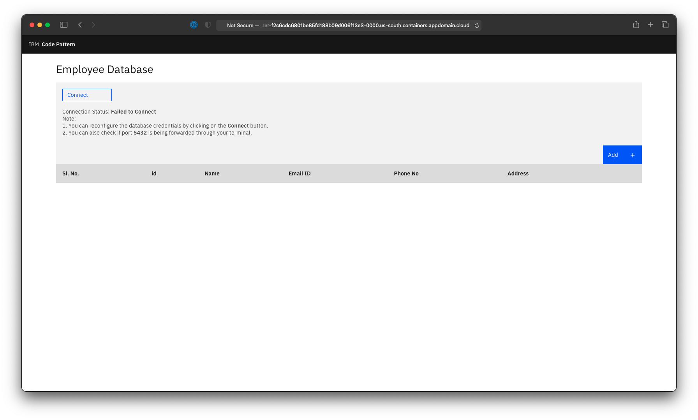

- Click on **Connect** button and enter the database credentials that you obtained in [3. Run the script to decrypt the Backup, and create a FlexApp from it](#3-run-the-script-to-decrypt-the-backup-and-create-a-flexapp-from-it) and click on **Submit**. The Client Application will now be connected to the postgresql database.
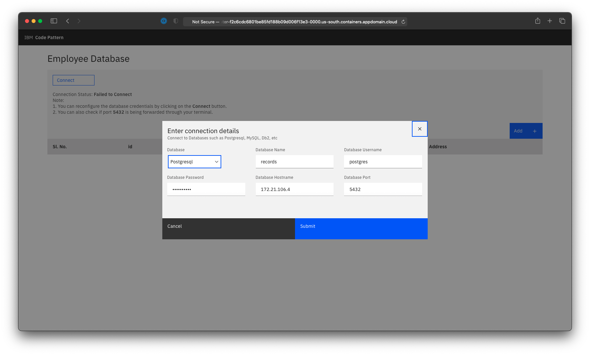

- You will see the exact same records in the postgresql database confirming the successful migration of the n-tier application from Kubernetes to OpenShift.
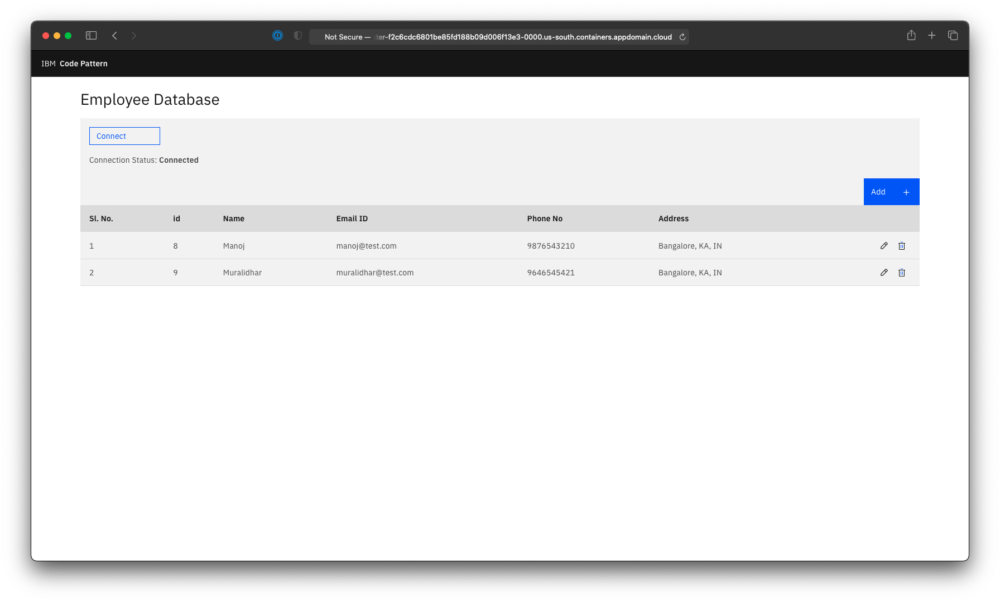


### Step 5: (Optional) Simulate catastrophic failure and recover from it

This section shows how you can recover your stateful application if there is any catastrophic failure with the database or the client application.

- Take a snapshot of the n-tier application before you begin. In terminal, run the following command:
    ```
    [robinds@kube-c1ima1bd0o105lencd5g-robinioopenshiftcl-default-0000029e ~]# robin snapshot create emp-mgmt --wait
    ```
    ```
    Job:  690 Name: K8SApplicationSnapshot State: WAITING         Error: 0
    Job:  690 Name: K8SApplicationSnapshot State: COMPLETED       Error: 0
    ```
- Now that you have the backup of n-tier application, you can simulate a catastrophic failure. Go ahead and delete all the rows from the Employee Table.
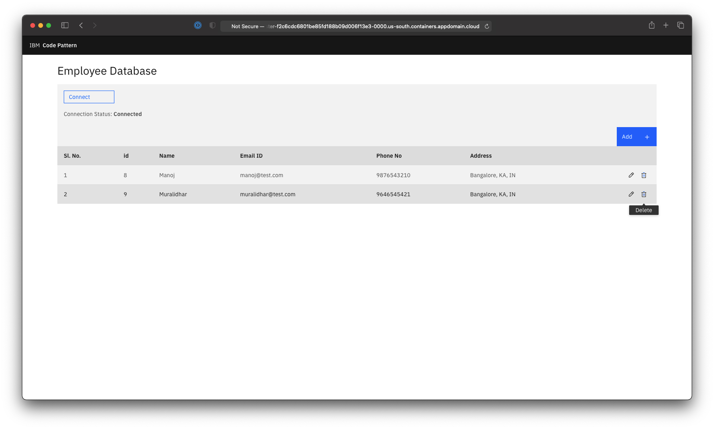
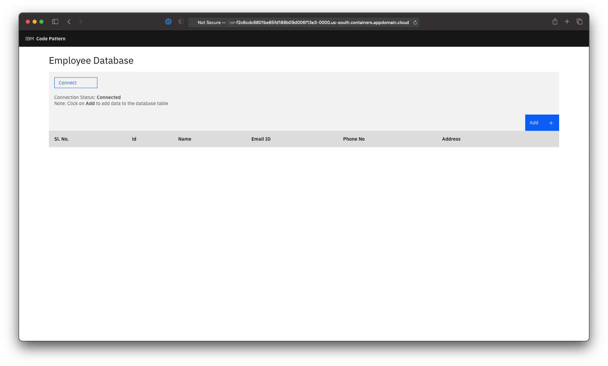

- You can restore all the data by simply running the following commands:
    - Get the Snapshot ID:
        ```
        [robinds@kube-c1ima1bd0o105lencd5g-robinioopenshiftcl-default-0000029e ~]# robin snapshot list --app emp-mgmt 
        ```
        ```
        +----------------------------------+--------+----------+----------+------------------------------+
        | Snapshot ID                      | State  | App Name | App Kind | Snapshot name                |
        +----------------------------------+--------+----------+----------+------------------------------+
        | b6fb9114b86911eb8b68f9cbb5113b62 | ONLINE | emp-mgmt | flexapp  | emp-mgmt_snapshot-1621404969 |
        +----------------------------------+--------+----------+----------+------------------------------+
        ```
    - Run the `robin restore` command:
        ```
        [robinds@kube-c1ima1bd0o105lencd5g-robinioopenshiftcl-default-0000029e ~]# robin app restore emp-mgmt --snapshotid b6fb9114b86911eb8b68f9cbb5113b62 --wait
        ```
        ```
        Job:  694 Name: K8SApplicationRollback State: VALIDATED       Error: 0
        Job:  694 Name: K8SApplicationRollback State: PREPARED        Error: 0
        Job:  694 Name: K8SApplicationRollback State: AGENT_WAIT      Error: 0
        Job:  694 Name: K8SApplicationRollback State: COMPLETED       Error: 0
        ```

- Now visit the client application, do note that you will have to reconnect the client application to the database with the credentials obtained in [3. Run the script to decrypt the Backup, and create a FlexApp from it](#3-run-the-script-to-decrypt-the-backup-and-create-a-flexapp-from-it). Once reconnected you will see the data restored.


## Summary
In this code pattern we used Robin CNS to take snapshot/backup of an n-tier stateful application running on Kubernetes. We restored the backed up application on to OpenShift. We verified that the stateful application is moved with all the right data. As a next step, you can explore [other features](https://docs.robin.io/storage/5.3.4/) provided by Robin

## License

This code pattern is licensed under the Apache License, Version 2. Separate third-party code objects invoked within this code pattern are licensed by their respective providers pursuant to their own separate licenses. Contributions are subject to the [Developer Certificate of Origin, Version 1.1](https://developercertificate.org/) and the [Apache License, Version 2](https://www.apache.org/licenses/LICENSE-2.0.txt).

[Apache License FAQ](https://www.apache.org/foundation/license-faq.html#WhatDoesItMEAN)
