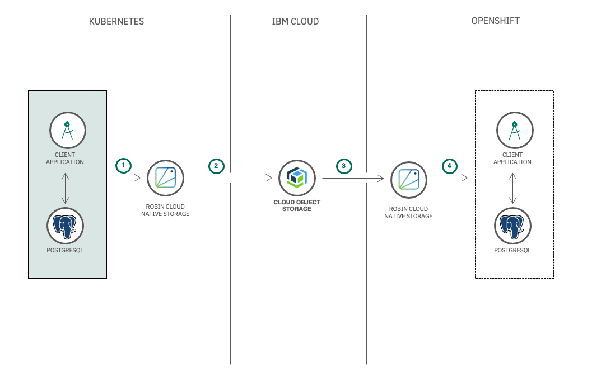

# Migrate a n-tier stateful application from IBM Kubernetes service to Red Hat OpenShift

## Summary
In this code pattern, we will demonstrate how to create snapshots, backup and restore n-tier stateful applications on Kubernetes and OpenShift using Robin Cloud Natice Storage. We will show how a PostgreSQL database instance and a custom application that does CRUD operations are packaged to take backup and restore with a few simple Robin CNS commands. 

## Description

Robin Cloud Native Storage is an application-aware container storage that offers advanced data management capabilities and runs natively on any Kubernetes distribution including IBM Kubernetes Service and Red Hat OpenShift Kubernetes Service. Robin Cloud Native Storage enables you to Protect (via Snapshots, Backups), Secure (via encryption), Collaborate (via Clones and git like push/pull workflows), and make Portable (via Cloud-sync) any Stateful application that is deployed using Helm Charts or Operators.

In this code pattern we will take a snapshot of an n-tier stateful application, create a backup and restore the backup using Robin CNS. We will migrate stateful application from IBM Kubernetes Service to Red Hat OpenShift Kubernetes Service. We will deploy a simple `Employee Database` application which can add/edit/delete employees data through a simple UI. Employees data will be stored in PostgreSQL database. In this code pattern we will show how to take snapshots of running application, back them up and restore the application state with just a few simple commands.

When you have completed this code pattern, you will understand how to:
- Setup Robin CNS
- Create snapshots and backup your stateful applications on to a remote Object Storage
- Package a n-tier application into a simple Robin Flexapp
- Restore any backup to any local/remote Kubernetes distribution

## Flow

1. Package your n-tier stateful application into a Robin FlexApp on Kubernetes
2. Capture Robin Snapshot of the FlexApp and backup to Cloud Object Storage
3. Decrypt the backup from Cloud Object Storage and restore the backup on OpenShift
4. Create a Robin FlexApp from the restored backup to get the stateful application as it is from Kubernetes to OpenShift

## Instructions

Find the details of the following steps in the [README](https://github.com/IBM/backup-and-restore-stateful-applications-between-iks-and-roks)

1. Setup applications on Kubernetes to simulate existing environment
2. Backup stateful application
3. Restore the backedup stateful application to OpenShift
4. Verify the restored stateful application
5. (Optional) Simulate Catastrophic Failure and Recover from it